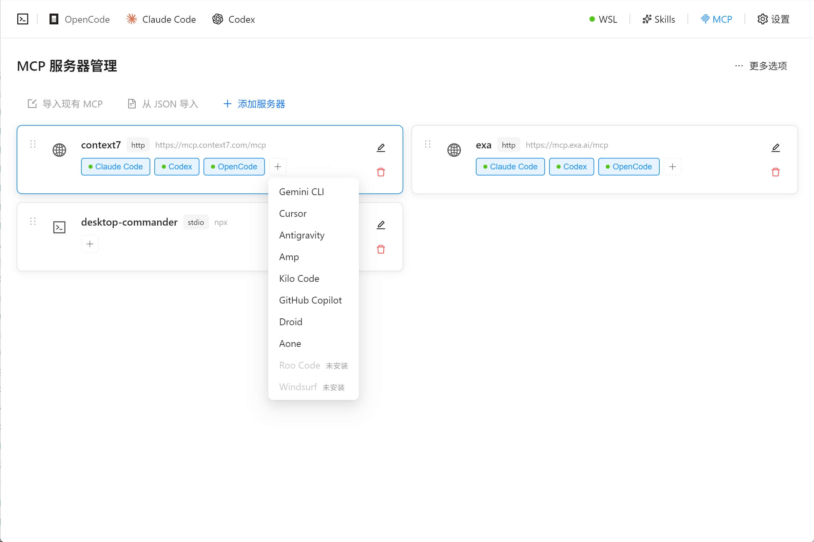
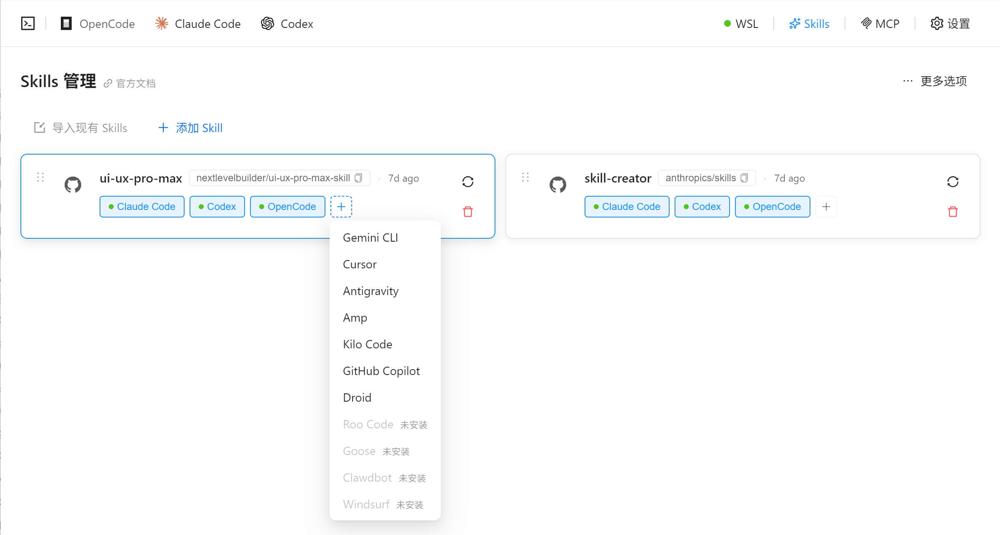

# PiHub

<p align="center">
  
</p>

<p align="center">
  <strong>个人 AI 工具箱</strong> - 一站式管理 Pi CLI 配置
</p>

<p align="center">
  <a href="https://github.com/lllll081926i/pihub/releases">
    
  </a>
  <a href="https://github.com/lllll081926i/pihub/blob/main/LICENSE">
    
  </a>
  <a href="https://github.com/lllll081926i/pihub/releases">
    
  </a>
</p>

---

## 简介

PiHub 是一个跨平台桌面应用，面向 **Pi CLI** 提供可视化的配置管理体验。支持 **Windows**、**macOS** 和 **Linux**。

### 主要功能

- **Pi 配置管理** - 可视化管理 Pi CLI 的供应商、模型、Prompt、扩展和其他运行时配置
- **扩展管理** - 通过 Pi CLI 安装、升级、移除扩展（支持 `--no-approve` 无交互安装）
- **Pi 会话管理** - 浏览、搜索、重命名、导入、导出和删除 Pi 会话
- **MCP 服务器管理** - 集中管理 MCP（Model Context Protocol）服务器配置，支持导入/导出、收藏、分组；通过 pi-mcp-adapter 将 `mcpServers` 同步到 Pi 运行时
- **Skills 技能管理** - 管理 Skills 中央仓库（默认 `~/.agents/skills`），支持从 Git 仓库/本地目录安装、启停同步和分组管理
- **供应商管理** - 统一管理多个 AI 供应商（OpenAI、Anthropic、Google、OpenRouter 等）并快速切换
- **Token Stats** - 查看 Pi 会话的 Token 用量统计，支持一键清理缓存
- **系统托盘** - 通过系统托盘快速切换供应商、模型、Prompt、MCP 和 Skills 启用状态，无需打开主窗口
- **数据备份** - 支持数据库整库导出/导入，导入前自动校验并备份旧库
- **主题切换** - 支持亮色/暗色/跟随系统主题
- **多语言** - 支持中文和英文界面
- **自动更新检查** - 启动时自动检查新版本

## 截图

<p align="center">
  
  
  <br>
  <em>MCP 服务器管理 / Skills 技能管理</em>
</p>

## 下载安装

前往 [Releases](https://github.com/lllll081926i/pihub/releases) 页面下载适合您系统的安装包：

| 系统 | 安装包 |
|------|--------|
| Windows | `.msi` / `.exe` |
| macOS | `.dmg` |
| Linux | `.deb` / `.AppImage` |

macOS 也可以通过 Homebrew 安装、升级和卸载：

```bash
brew tap lllll081926i/pihub https://github.com/lllll081926i/pihub
brew install --cask lllll081926i/pihub/pihub
sudo xattr -rd com.apple.quarantine /Applications/AI\ Toolbox.app

brew upgrade --cask lllll081926i/pihub/pihub
brew uninstall --cask lllll081926i/pihub/pihub
# 可选：不再需要此 tap 时移除
brew untap lllll081926i/pihub
```

说明：

- 当前 Cask 暂时直接托管在本仓库，因此首次需要使用带仓库 URL 的 `brew tap`。
- 后续发布新版本后，仓库中的 `Casks/pi-hub.rb` 会由 release workflow 自动更新，`brew upgrade` 即可获取新版本。

## 技术栈

| 类别 | 技术 |
|------|------|
| **桌面框架** | Tauri 2.x |
| **前端** | React 19 + TypeScript 5 |
| **UI 组件库** | Ant Design 6 |
| **状态管理** | Zustand |
| **国际化** | i18next (中文/英文) |
| **数据库** | SQLite JSONB（SurrealDB 仅用于旧版本一次性导入） |
| **构建工具** | Vite 7 |
| **包管理器** | pnpm |

## 项目结构

```
ai-toolbox/
├── web/                          # 前端源码
│   ├── app/                      # 应用层（App、路由、Provider）
│   ├── components/               # 通用组件
│   │   └── layout/               # 布局组件（MainLayout）
│   ├── features/                 # 功能模块（按业务划分）
│   │   ├── coding/               # 【编码】模块
│   │   │   ├── pi/               # Pi 配置管理
│   │   │   ├── mcp/              # MCP 服务器管理
│   │   │   ├── skills/           # Skills 技能管理
│   │   │   └── shared/           # 供应商、会话、Magic Context 等共享能力
│   │   └── settings/             # 【设置】模块
│   ├── stores/                   # 全局状态（Zustand）
│   ├── services/                 # API 服务层
│   ├── i18n/                     # 国际化配置
│   ├── constants/                # 常量（模块配置、preset 模型）
│   ├── hooks/                    # 全局 Hooks
│   ├── types/                    # 全局类型定义
│   └── utils/                    # 工具函数
├── tauri/                        # Tauri 后端 (Rust)
│   ├── src/
│   │   ├── main.rs               # 入口
│   │   ├── lib.rs                # 库入口、命令注册
│   │   ├── db/                   # SQLite JSONB 数据库
│   │   ├── settings/             # 应用设置
│   │   ├── tray.rs               # 系统托盘
│   │   ├── update.rs             # 自动更新
│   │   └── coding/               # 编码模块
│   │       ├── pi/               # Pi 后端
│   │       ├── mcp/              # MCP 服务器后端
│   │       ├── skills/           # Skills 技能后端
│   │       ├── session_manager/  # Pi 会话管理后端
│   │       ├── tools/            # 工具适配（仅 Pi + 自定义工具）
│   │       ├── magic_context/    # Magic Context 配置
│   │       ├── preset_models/    # 预设模型数据
│   │       └── cli_resolver/     # CLI 解析
│   ├── Cargo.toml                # Rust 依赖
│   └── tauri.conf.json           # Tauri 配置
├── package.json                  # 前端依赖
├── vite.config.ts                # Vite 配置
└── tsconfig.json                 # TypeScript 配置
```

## 开发指南

### 前置要求

- Node.js 18+
- pnpm 9+
- Rust 1.86+
- 参考 [Tauri 前置要求](https://tauri.app/start/prerequisites/)

### 安装依赖

```bash
pnpm install
```

### 启动开发服务器

```bash
pnpm tauri dev
```

### 构建生产版本

```bash
pnpm tauri build
```

### 代码检查

```bash
# TypeScript 类型检查
pnpm tsc --noEmit

# Rust 代码检查
cd tauri && cargo check
```

## 功能模块

| 模块 | 子模块 | 状态 | 描述 |
|------|--------|------|------|
| 编码 | Pi | ✅ 完成 | Pi CLI 模型、供应商、Prompt、扩展和会话管理 |
| 编码 | MCP 服务器 | ✅ 完成 | MCP 服务器配置管理，支持导入/导出、收藏、分组和工具同步 |
| 编码 | Skills 技能 | ✅ 完成 | Skills 中央仓库管理，支持 Git/本地安装、启停同步和分组管理 |
| 编码 | 会话管理 | ✅ 完成 | Pi 会话浏览、搜索、重命名、导入、导出和删除 |
| 编码 | Token Stats | ✅ 完成 | Pi 会话 Token 用量统计与缓存清理 |
| 设置 | 通用设置 | ✅ 完成 | 语言切换、主题切换、代理和缓存管理 |
| 设置 | 数据备份 | ✅ 完成 | 数据库整库导出/导入，导入前校验与旧库备份 |

## 数据存储

使用 SQLite 作为本地主数据库，并通过 JSONB 表保存各模块配置。旧版本 SurrealDB 数据会在启动时执行一次性导入，导入完成后主数据以 SQLite 为准。

### 设计原则

- **本地优先**：所有数据存储在本地，保护隐私
- **服务层 API**：前端通过服务层与后端交互，不直接使用 localStorage
- **可靠备份**：备份为 SQLite 单文件 + `db_manifest.json`，导入前只读校验 `user_version` / JSONB / 完整性，导入时先备份旧库再替换

### 数据表

| 表名 | 描述 |
|------|------|
| `settings` | 应用设置 |
| `app_migration` | 应用内部迁移记录 |
| `pi_settings_config` | Pi 设置配置 |
| `pi_prompt_config` | Pi Prompt 配置 |
| `skill` | Skills 技能记录 |
| `skill_group` | Skills 分组 |
| `skill_repo` | Skills Git 仓库来源 |
| `skill_preferences` | Skills 技能偏好配置 |
| `skill_settings` | Skills 设置 |
| `custom_tool` | Skills/MCP 自定义工具配置 |
| `mcp_server` | MCP 服务器配置 |
| `mcp_preferences` | MCP 服务器偏好配置 |
| `favorite_mcp` | MCP 收藏配置 |
| `token_stats_cache` | Token 用量统计缓存 |

## 贡献

欢迎提交 Issue 和 Pull Request！

1. Fork 本仓库
2. 创建特性分支 (`git checkout -b feature/amazing-feature`)
3. 提交更改 (`git commit -m 'Add some amazing feature'`)
4. 推送到分支 (`git push origin feature/amazing-feature`)
5. 提交 Pull Request

## 推荐 IDE 配置

- [VS Code](https://code.visualstudio.com/)
- [Tauri 插件](https://marketplace.visualstudio.com/items?itemName=tauri-apps.tauri-vscode)
- [rust-analyzer](https://marketplace.visualstudio.com/items?itemName=rust-lang.rust-analyzer)

## License

[MIT](LICENSE)

## Acknowledgments

- [skills-hub](https://github.com/qufei1993/skills-hub)
- [linux.do](https://linux.do)
- [axonhub](https://github.com/looplj/axonhub)
