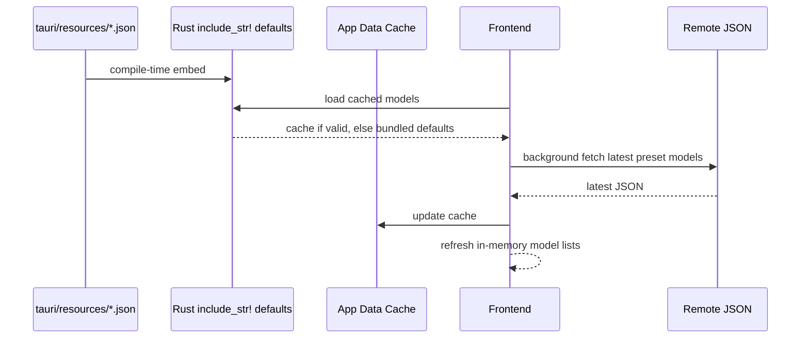

# 模型资源说明

## 一句话职责

- `tauri/resources/` 存放会被后端在编译期嵌入的模型默认数据资源；这里的 JSON 不是运行时缓存副本，而是本仓随版本发布的 bundled defaults。

## Source of Truth

- `preset_models.json` 是预设模型默认数据的源码来源。`tauri/src/coding/preset_models.rs` 通过 `include_str!` 在编译期嵌入它；应用启动后前端先读 app data 里的缓存，再回退到这里的 bundled defaults，随后后台拉远端最新版本更新内存和缓存。
- `model_pricing.json` 是 Gateway 官方模型定价默认数据的源码来源。`tauri/src/db/model_pricing_seed.rs` 通过 `include_str!` 编译期嵌入它，并在 SQLite migration 后用 `INSERT OR IGNORE` 增量补齐 `model_pricing` 表。
- 备份/恢复里读写的 `preset_models.json`、`model_pricing.json` 都是 app data 缓存文件；不要把这些缓存链路误认为仓库内 `tauri/resources/*.json` 会被运行时直接原地改写。

## 核心设计决策（Why）

- 这些 JSON 放在 `tauri/resources/`，是为了让应用在无网络、缓存缺失或远端拉取失败时仍有稳定的默认模型数据可用。
- `preset_models.json` 的数组顺序是用户可见语义，不只是排版。前端预设模型选择 UI 直接按分组数组顺序渲染，不会再做二次排序。

## 关键流程

## 易错点与历史坑（Gotchas）

- 改 `preset_models.json` 时，不要只看"有没有这个模型"，还要看它在同组数组里的位置；顺序会直接影响预设标签展示顺序。
- 新增某个模型家族的新版本时，默认应放在对应旧版本前面，而不是机械地塞到整栏最前。
- 给新模型补预设时，若需求是"参数和旧模型一样"，优先复制对应旧模型条目，只做 `id` / `name` 和必要顺序调整，不要顺手改能力字段。
- 预设只要声明 `contextLimit` 或 `outputLimit`，两个字段就必须成对存在，避免生成无法通过校验的半完整 `limit`。
- `model_pricing.json` 保存标准请求的基础单价，不能表达长上下文分段计费。OpenAI 官方单独公布的 cache write 单价仍写入 `cache_creation_cost_per_million`，实际是否产生该费用取决于 usage 是否提供 cache creation token。
- 不要在这里记录"远端缓存刷新后也许会覆盖本地顺序"之类推测；判断最终线上效果时，要先区分当前看到的是 bundled defaults 还是 app data / 远端缓存数据。
- 新增模型家族预设时，若官方 API 语义与现有结构不同（如推理档位、多模型路由 alias），先在模块级文档记录产品兼容取值，再改 JSON；不要把兼容值表述成厂商已正式公布能力。

## 跨模块依赖

- `tauri/src/coding/preset_models.rs` 依赖 `preset_models.json` 作为编译期默认数据，并向前端暴露加载缓存与远端刷新命令。
- `tauri/src/db/model_pricing_seed.rs` 依赖 `model_pricing.json` 作为 Gateway 官方模型定价默认数据；运行时远端同步只增量插入缺失行，不覆盖用户已有价格。
- `web/app/providers.tsx` 在启动时先加载 preset models 本地缓存，再异步拉远端并更新前端内存态。
- 备份恢复模块会单独备份和恢复 app data 下的 `preset_models.json`、`model_pricing.json` 缓存文件。

## 典型变更场景（按需）

- 改 `preset_models.json` 时，至少检查：
  - 是否仍是合法 JSON。
  - 模型放在了正确分组。
  - 相对顺序是否符合用户可见展示语义。
- 改 `model_pricing.json` 时，至少检查：
  - 是否仍是合法 JSON 数组。
  - 每个对象字段是否与 SQLite `model_pricing` 表一致，成本字段是否仍是非负数字字符串。
  - 新增默认价格不会覆盖用户已有行；修正已存在模型的官方价格不会自动改写老用户数据库。

## 最小验证

- 修改任一 JSON 后，至少做一次 JSON 合法性校验。
- 修改 `preset_models.json` 后，至少复核消费端是否仍按数组顺序直出，没有额外排序。
- 修改模型限制后，必须确认所有预设的 `contextLimit` 与 `outputLimit` 仍然成对存在。
- 修改 `model_pricing.json` 后，至少跑一次 `cargo test model_pricing_seed` 或等价测试，确认 bundled JSON 可解析且 seed 仍是 `INSERT OR IGNORE` 语义。
- 如果本轮同时改了缓存/远端刷新链路，还要额外区分 bundled defaults、app data cache 和 remote fetch 三条路径分别验证。