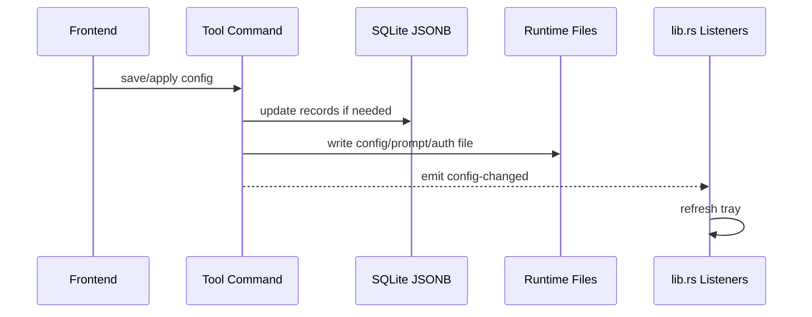

# Coding 模块说明

## 一句话职责

- `tauri/src/coding/` 是内置 coding 工具（Pi）、Skills、MCP 和运行时定位的共享后端域。
- 这里最重要的不是某个工具单独怎么存，而是跨工具共享的路径决议、事件约定和跨平台执行语义。

## Source of Truth

- Pi 的业务配置主数据分别存于 SQLite JSONB 和对应运行时配置文件，两者都重要，但“当前生效路径”不是简单看页面输入框，而是由 `runtime_location` 统一决议。
- `runtime_location` 是各 coding tab 当前运行时位置、WSL Direct 状态和派生文件路径的唯一共享规则源。
- `runtime_location` 的同步 helper 只允许读取进程内 runtime location cache 或无 DB fallback；需要 SQLite、环境变量和 shell 配置参与解析时，必须走异步 refresh API 先刷新缓存，不能在同步 helper 里查 DB 或 `block_on`。
- 对这些 runtime tab，`source` 与 `is_wsl_direct` 是两个独立维度：`source` 只说明路径来源，`is_wsl_direct` 只说明当前生效路径是否为 WSL UNC；`module_statuses` 来自后者，不来自页面展示。
- `config-changed`、`skills-changed`、`mcp-changed` 是跨模块联动的主事件契约；事件本身不保存状态，只触发后续动作。
- provider 增删改、排序和导入操作需要继续触发 `config-changed`；全局监听器会用它刷新托盘。
- Magic Context 配置是 CortexKit 共享文件。PiHub 当前只管理用户级配置；本机 Unix 路径优先使用 `$XDG_CONFIG_HOME/cortexkit/magic-context.jsonc`，未设置时回退 `~/.config/cortexkit/magic-context.jsonc`，Windows 使用 `%USERPROFILE%\.config\cortexkit\magic-context.jsonc`。WSL Direct 下用户级路径必须按 WSL 用户 home 派生为 UNC 路径。

## 核心设计决策（Why）

- runtime tab 的运行时路径统一收敛到 `runtime_location.rs`，避免每个模块各自判断 WSL UNC、默认路径和派生路径，导致逻辑分叉。
- 托盘刷新采用全局 `config-changed` 事件，而不是每个模块各自直接操作托盘，这样主窗口和托盘入口可以共享一套刷新机制。

## 关键流程

## 易错点与历史坑（Gotchas）

- 通用配置「从当前文件提取」以及 DB 为空时的磁盘 common 回退，都会直接读 WSL UNC / 网络根目录下的 runtime 文件。`Path::exists` / `fs::read_to_string` 在不可达路径上可能长时间阻塞；这些路径必须用 `coding::file_io`（`tauri/src/coding/file_io.rs`）的 `path_exists_async` / `read_to_string_async` / `read_json_object_or_empty_async` / `write_json_object_async` 做 `spawn_blocking` + 超时读，Pi runtime 配置读（settings/auth/models）与 root-dir 布局探测（`normalize_pi_root_dir_async`）已接入。`tokio::time::timeout` 只保证 await 返回，不会取消已卡住的 OS 读；`file_io` 内部用有界信号量限制并发阻塞读，避免超时后 blocking 线程堆积打满线程池。新增对 WSL UNC 路径的阻塞式文件操作时，复用 `file_io`，不要直接写裸 `fs::` 调用。
- 不要把“页面上显示的 `source`”和“WSL/SSH 设置页里的 `moduleStatuses.is_wsl_direct`”混为一谈。前者是路径来源标签，后者是对当前生效运行时路径的统一诊断结果。
- 改 `root_dir` / `config_path` 保存逻辑时，保存 DB 后要先刷新对应 runtime location cache，再继续 apply 配置文件、比较 Skills 目标路径、发相关同步事件。否则后续同步 helper 可能继续消费旧路径。
- 对用户自行安装的 CLI，不要默认 GUI 进程里 `PATH` 可用。尤其 macOS 从 Dock/Finder 启动时，新增调用应优先解析已知安装位置或显式配置路径，再回退到 `PATH`。
- 本机 CLI 查找统一走 `cli_resolver.rs`。不要在单个工具模块里各自手写 `which`/`where`、nvm、volta、fnm、bun 或 Windows `.cmd`/`.bat` 处理，否则 Dock/Finder 启动和 Node/bun 全局安装场景会再次分叉。
- Windows GUI 宿主（`windows_subsystem = "windows"`）spawn 短生命周期 CLI / `wsl` / `where` 时必须设 `CREATE_NO_WINDOW`（`0x08000000`），否则会闪 cmd 黑窗。本机命令统一经 `build_local_*_command`（内部已应用）；`where` lookup 也在 `cli_resolver` 内处理。直接 `Command::new("wsl")` 的路径需调用 `apply_create_no_window` / `apply_create_no_window_tokio`。捕获 stdout/stderr 时用 `CREATE_NO_WINDOW`，不要用 `DETACHED_PROCESS`。
- `cli_resolver` 的全局 bin 候选除 nvm/volta/fnm/nvm-windows/npm 外，还必须覆盖 bun：`$BUN_INSTALL/bin` 与默认 `~/.bun/bin`（Windows 含常见扩展后缀）。GUI 进程通常不继承终端 shell PATH，`bun install -g pi` 一类安装在 PATH 外时只能靠这些候选路径命中。
- `cli_resolver` 的全局 bin 候选还必须覆盖 mise 与 asdf。mise 数据根扫描顺序：`$MISE_DATA_DIR` → `$XDG_DATA_HOME/mise` → `~/.local/share/mise` → `%LOCALAPPDATA%\mise`（Windows）；asdf：`$ASDF_DATA_DIR` → `~/.asdf`。每个根下扫 `shims` 与 `installs/node`（mise）/`installs/nodejs`（asdf）版本 bin。mise `npm:` backend 包（如 `mise use -g npm:earendil-works/pi-coding-agent`）的真实 bin 路径含包名无法泛化，shim 目录才是稳定入口。mise/asdf shim 本质是 `exec mise`/`exec asdf`，依赖本体在子进程 PATH；`build_local_command_path` 必须在检测到 shims 存在时，把 shims 与本体常见目录（`~/.local/bin`、`/opt/homebrew/bin`、`/usr/local/bin`）补进子进程 PATH，否则即便命中 shim 也会因找不到本体而 spawn 失败。无 mise/asdf 时该补齐为空操作。单元测试必须通过可注入的 data roots 测候选/PATH 逻辑，禁止直接依赖宿主 `MISE_DATA_DIR`/`ASDF_DATA_DIR`，否则真实 mise 开发机会 flaky。
- 找到 Node-based CLI shim 本身还不够。像 Pi 的 `pi` 脚本可能通过 `#!/usr/bin/env node` 再查找 `node`；macOS GUI 启动环境即使能解析到 `pi`，子进程 `PATH` 也可能缺少 Node bin。新增本机 CLI spawn 能力时应复用 `cli_resolver` 构造命令，让它同时补齐 CLI 所在目录和可发现的 Node runtime 目录。
- 删除已保存的 prompt 配置只删 SQLite 记录，不删除/清空当前 runtime 本地 prompt 文件。产品语义是“删除记录”，不是“清空本地生效提示词”。
- Pi 的 provider 事实源就是 runtime 文件，删除会按 scope 改 `auth.json` / `models.json`。
- 新增跨工具共享规则时，优先放在共享层，不要把通用逻辑塞进某个单独工具目录，否则后续很快出现“相邻工具修了一边，另一边继续错”。
- All API Hub 导入的浏览器扩展发现属于跨工具共享后端能力。当前应按 Chrome 优先、Edge 兜底的顺序扫描 Chromium profile 的 `Local Extension Settings`；Edge 既要兼容从 Chrome Web Store 安装的扩展 ID，也要兼容 Edge Add-ons 当前 ID。
- Magic Context 的 `doctor` 通过 `npx @cortexkit/magic-context@latest doctor --harness pi` 运行。本机命令解析要走 `cli_resolver.rs`，WSL Direct 要在目标 distro 内执行 `npx`，不能用 Windows home 或 Windows PATH 代表 WSL 运行环境。

## 跨模块依赖

- 被 `skills/`、`mcp/` 和各工具模块依赖：它们都会消费 `runtime_location` 的派生路径或 WSL Direct 状态。

## 典型变更场景（按需）

- 新增需要调用工具 CLI 的能力时：
  先检查现有内置工具是否都存在同类调用点，并确认本机/WSL Direct 两套执行路径。
- 新增新的跨模块事件时：
  先判断是否应复用现有事件契约；如果新增，必须同时梳理监听端和前端刷新端。

## 最小验证

- 改 `runtime_location` 后，至少验证一个本机路径场景和一个 WSL UNC 路径场景。
- 改事件约定后，至少验证主窗口保存、托盘刷新两者是否仍一致。
