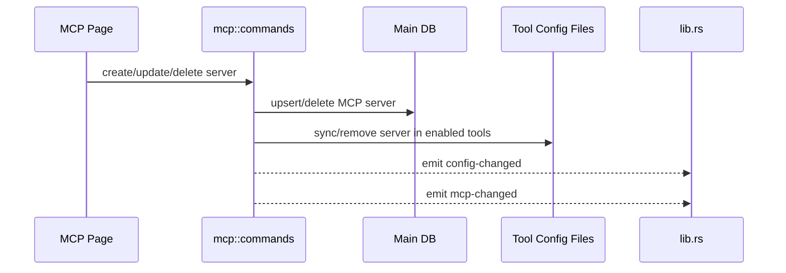

# MCP 后端模块说明

## 一句话职责

- `mcp/` 负责 MCP Server 的数据库存储、排序、导入导出，以及同步到各个工具运行时配置文件。

## Source of Truth

- MCP server 主数据存于主数据库的 `mcp_server` 相关表；必须直接读写 SQLite JSONB，旧 SurrealDB 仅用于启动时一次性导入。各工具配置文件中的 MCP 节点是派生结果，不是主数据。
- 每个 server 的 `enabled_tools` 和 `sync_details` 描述“应该同步到哪些工具”和“最近同步结果”，不是工具配置文件的反向解析真相。
- `user_group/user_note` 是 PiHub 内部的用户管理元数据，不写入任何工具 MCP 配置，也不触发 MCP 同步。
- WSL 自动同步感知的不是某个工具配置文件具体变了什么，而是 `mcp-changed` 事件。

## 核心设计决策（Why）

- MCP 采用“中心存储 + 同步到工具配置”的模型，避免用户分别改各工具的各自配置。
- 创建、更新、删除 server 后立即同步到所有启用工具，并统一发 `config-changed` + `mcp-changed`，这样托盘和 WSL 自动同步都能跟上。
- 备份恢复是例外：恢复编排必须调用不发事件的 MCP 全量同步入口，等本机 re-apply、Skills、MCP 全部串行完成后再由恢复任务统一执行一次 WSL 同步，避免 `mcp-changed` 在中途启动并发同步。
- 导入已有配置时应尽量走共享 config sync 能力，而不是为每个工具复制一套解析逻辑。
- 更新 `user_group/user_note` 只改变 PiHub 内部列表组织信息，不应走 server CRUD 重同步链路。

## 关键流程

## 易错点与历史坑（Gotchas）

- 不要把工具配置文件当作 MCP 的 source of truth。真正要改的是中心存储，再同步下发。
- 改同步逻辑时要同时考虑“启用工具集合变化”“删除时清理工具配置”三类路径，不要只修新增路径。
- WSL 自动同步依赖 `mcp-changed` 事件；如果只更新数据库、不发事件，WSL 侧不会跟进。
- 不要把恢复专用 no-event 入口复用到普通 CRUD/手动同步路径；它只用于已有外层编排明确负责最终 WSL 投影的场景。
- Windows 下给 `npx` / `npm` / `node` 等 stdio command 加 `cmd /c` 时，判断依据必须是目标配置文件的运行平台，不是 PiHub 进程平台。普通 Windows 本机目标需要包装；WSL UNC / WSL Direct 目标不能包装，否则远端 Linux CLI 会读到无效的 `cmd`。
- Grok 是明确例外：官方 Grok MCP schema 在 Windows 本机、WSL 和 SSH 都保持裸 `npx`，不写 `cmd /c`；同时使用 `headers` 而非 Codex 的 `http_headers`，不写 `type`，并保留 `cwd/enabled/startup_timeout_sec/tool_timeout_sec/tool_timeouts/bearer_token_env_var`。
- Codex 与 Grok 共享秒级超时字段 `startup_timeout_sec` / `tool_timeout_sec`，存放在中心存储的 `server_config` 里（不是顶层 OpenCode 毫秒字段 `timeout`）。同步到 Codex `config.toml` 时由 `build_toml_edit_server_config` 写出；未设置则不写，让 Codex 使用官方默认（启动约 10s、工具约 60s）。导入 Codex TOML 时必须回读这两个字段，避免再同步时丢失。
- Pi 的 MCP 目标不是 Pi 原生能力，而是 `pi-mcp-adapter` 扩展读取的 `<Pi runtime root>/mcp.json`。同步时仍以中心 MCP 存储为 source of truth，只把标准 JSON `mcpServers` 写入该派生配置文件。MCP 配置的编辑与同步不依赖 adapter 是否已安装（部分 npm 包自带 MCP 支持），页面不设 adapter 安装门禁，也不提供 adapter 检测/安装命令。
- Antigravity 2.0 的远程 HTTP MCP 字段是 `serverUrl`，不是 Gemini/Qwen 的 `httpUrl`，也不是通用 `url`。中心存储仍统一用 `server_config.url`，只在同步到 Antigravity 配置和从 Antigravity 配置扫描时做字段转换；扫描时要兼容历史写出的 `httpUrl`，避免丢用户已有配置。
- 「导入现有 MCP」扫描已安装工具配置。发现结果按工具分组展示（前端走 pluginGroups 同款分组）。同步目标仍是弹窗勾选的 `enabledTools`。

## 跨模块依赖

- 依赖 `tools/` 和 `runtime_location` 解析可用工具及对应 MCP 配置路径。
- 被 `web/features/coding/mcp/` 依赖：页面操作全部围绕这里的 Tauri commands。

## 典型变更场景（按需）

- 新增工具支持时：
  同时检查 runtime tool 注册、配置路径解析、导入扫描和 sync/remove 实现。
- 改 server CRUD 时：
  同时检查同步明细、工具配置文件更新和 `mcp-changed` 事件。

## 最小验证

- 至少验证：新增/编辑/删除 server 后中心存储和目标工具配置文件都变化。
- 至少验证：操作后仍会发出 `mcp-changed`，WSL 自动同步链路保持可触发。
