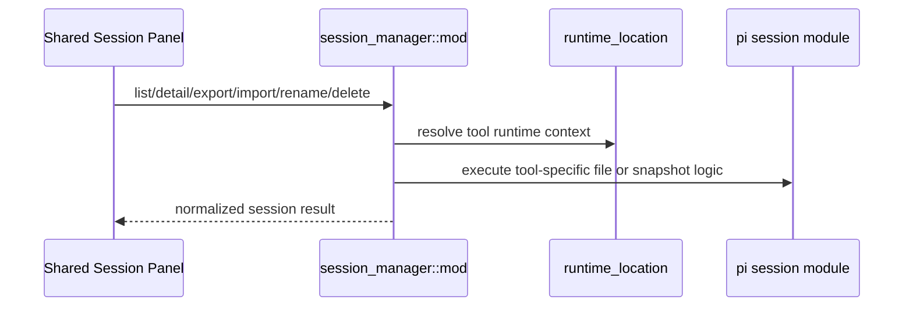

# Session Manager 后端模块说明

## 一句话职责

- `session_manager/` 负责 Pi 会话的列表、详情、路径过滤、重命名、删除、导入和导出。

## Source of Truth

- 会话的真实来源不是数据库，而是 Pi 运行时目录或导出快照。
- `source_path` 是会话操作的关键标识。
- 当前工具的会话上下文路径必须先经 `runtime_location` 决议，再派生 sessions 等目录。

## 核心设计决策（Why）

- 会话上下文解析通过 `ToolSessionContext` 隔离文件布局（当前仅 Pi）。
- 读会话详情、删除、导出等重 I/O 操作统一放进 `spawn_blocking`，避免堵塞 Tauri async runtime。
- 导出使用统一 schema `ai-toolbox.session-export.v2`，同时保留 normalized messages 和 native snapshot。
- 会话详情页和导出里的消息展示统一消费 normalized `SessionMessage.blocks`。Pi parser 负责把 raw runtime shape 转成 text/thinking/tool_call/tool_result 等 block。
- 会话详情右侧导航统一依赖 normalized `SessionMessage.id` 派生 DOM target。Pi parser 读取详情时必须保证每条消息都有 id；运行时原始数据没有 id 时使用共享 helper 补 provider-scoped fallback id。

## 关键流程

## 易错点与历史坑（Gotchas）

- 对 Pi 删除，不要为了确认 `source_path` 再先全量扫描会话缓存。`source_path` 自身就能解析出 `session_id` 并直接执行删除；预扫描只会把单删/批删放大成整库遍历。
- 对 Pi 删除，直删语义仍要保持幂等。若底层文件已不存在，应视为成功收敛，而不是把重复删除、并发删除或陈旧列表操作升级成 `Session not found`。
- 批量删除不能只在前端循环调单删就算完成。后端需要返回 partial success 结果，明确区分 `deleted_count` 和逐条失败项。
- 列表搜索如果用户输入完整 `session_id`，共享层必须先做精确 ID 短路并直接返回匹配项，不能继续扫描其它会话正文。
- 普通会话列表首屏可以使用最近候选 quick load 优先返回少量结果，但后台补全、搜索、目录筛选、强制刷新、删除/导入后的刷新必须保留完整扫描语义并返回完整列表。
- 所有 CLI 的首屏 recent quick path 都应复用共享的最近文件早停扫描。
- 会话列表缓存采用 stale-while-refresh 语义：过期完整缓存仍可用于 `cache-first` 立即展示，并通过 `cache_state=stale` 提醒前端后台刷新；只有主动刷新、删除、导入等真实变更才应显式失效或重建缓存。
- `cache-first` 首屏不能为了补齐未缓存的远端/WSL context 去做 recent 扫描；应先返回已有完整缓存或本地轻量 recent，并用 `partial/meta_complete=false` 触发后台完整刷新。
- 会话管理没有后端分页语义。`page/page_size/has_more` 字段只为旧契约兼容保留；新 UI 不应依赖它们实现“加载更多”。`load_mode=full` 和 `load_mode=refresh` 必须返回完整过滤结果，完成后 `has_more=false`。
- `load_mode=full` 是后台完整补全和搜索事实源：必须扫描所有被 source mode 接受的 context，更新完整缓存，并返回完整列表。
- `load_mode=refresh` 是主动重建完整列表：用于手动刷新、删除、导入后的收敛，必须绕过旧缓存重建完整缓存。
- 搜索分两层：先用已加载/缓存的 metadata 字段加速，包括 `session_id`、标题、摘要、项目目录、`source_path`、runtime source/distro；只有 `full/refresh/auto` 深搜时才允许扫描消息正文。
- 搜索完整 `session_id` 必须优先精确匹配并短路正文扫描。
- 导出/导入格式校验是强约束；改 schema、version、tool alias 时必须同步兼容检查。
- 新增或调整消息类型时，优先扩展 normalized block 中间层和工具名归一化逻辑，不要只在 parser 里拼接 `content` 字符串。
- resume 命令的目录前缀必须区分路径格式：Windows drive/UNC 路径用 Windows shell 兼容的 `pushd "<path>" && ...`，macOS/Linux 路径用 `cd <quoted-path> && ...`。

## 跨模块依赖

- 依赖 `runtime_location` 决议当前运行时根。
- 依赖 `web/features/coding/shared/sessionManager/` 作为唯一前端入口。
- 与 Pi 模块的会话子实现强耦合。

## 典型变更场景（按需）

- 新增会话字段或格式支持时：
  同时检查 list/detail/export/import/rename/delete 全链路，而不是只改列表。

## 最小验证

- 至少验证：list/detail/export/import/rename/delete 至少一条往返路径。
- 改导出格式时，至少验证 schema/version/tool alias 校验没有破坏旧导入。
